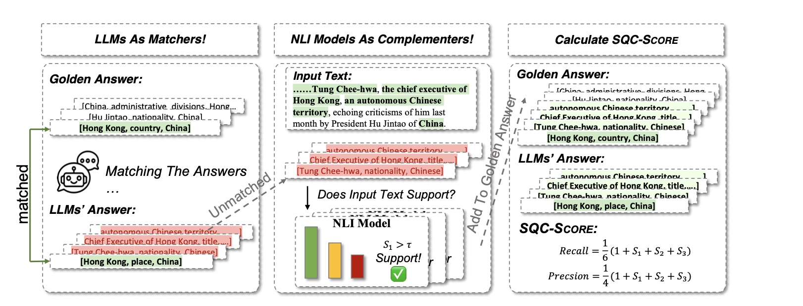
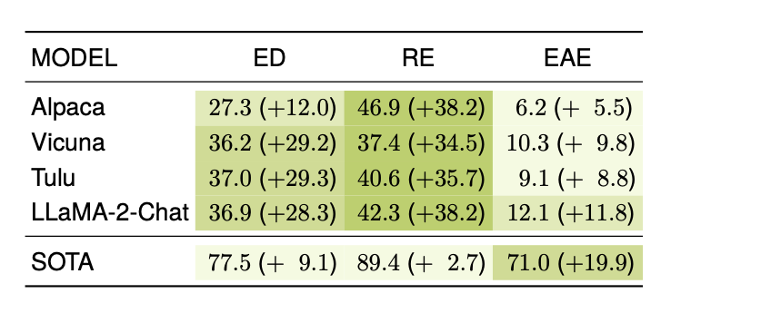

# Evaluating Generative Language Models in Information Extraction as Subjective Question Correction
> Modern Large Language Models (LLMs) have showcased remarkable prowess in various tasks necessitating sophisticated cognitive behaviors. Notwithstanding, a paradoxical performance discrepancy is observed, where these models underperform in seemingly elementary tasks like relation extraction and event extraction due to two issues in conventional evaluation. The imprecision of existing evaluation metrics that struggle to effectively gauge semantic consistency between model outputs and ground truth. The inherent incompleteness of evaluation benchmarks, primarily due to restrictive human annotation schemas, resulting in underestimated LLM performances. Inspired by the principles in subjective question correction, we propose a new evaluation method, SQC-SCORE. This method innovatively utilizes LLMs, fine-tuned through subjective question correction data, to refine matching between model outputs and golden labels. Additionally, by incorporating a Natural Language Inference (NLI) model, SQC-SCORE enriches golden labels, addressing benchmark incompleteness by acknowledging correct yet previously omitted answers. Results on three information extraction tasks show that SQC-SCORE is more preferred by human annotators than the baseline methods. Utilizing SQC-SCORE, we conduct a comprehensive evaluation of the state-of-the-art LLMs and provide insights for future research for information extraction.

This is the accompanying code & data for the paper **Evaluating Generative Language Models in Information Extraction as Subjective Question Correction**.

## Preliminary Requirements
Make sure you have access to Llama weights through [Llama-2-7b-chat-hf](https://huggingface.co/meta-llama/Llama-2-7b-chat-hf).
Install all the dependencies using the following commands
```
conda create -n <your-env-name> python=3.10
pip install -r requirements.txt
```
Put the model weights under the directory MODELS and complete the missing parameters in the ```run_train.sh``` file to get your fine-tuned models using commands below.
```
chmod +x run_train.sh
./run_train.sh
```
## Dataset for Evaluation
Considering the copyrights for ACE2005, we cannot release our data for the experiments. You can get the ACE2005 dataset through [ACE2005](https://catalog.ldc.upenn.edu/LDC2006T06).
After obtaining the dataset, feel free to use our instructions listed in the Appendix to get the model predictions.
You can use your own dataset for evaluation. Make sure that each record in the datasets should be in the form below.
```
record/
├─  standard_answer/: original gold labels(each point assigned 2 marks). It should be a list of triples represented in a list.
├─  student_answer/: predictions of LLMs. It should be a list of triples represented in a list
├─  total_score/: total marks of the standard_answer
```
## Using SQC-Score
```
CUDA_VISIBLE_DEVICES=0 python sqc_score.py --in_file <path> --score_model <path> --out_dir <path> --do-nli True
```
## Our Results on IE tasks

## Citation
If you find our work useful, please consider citing SQC-Score:
```
@article{fan2024sqc,
      title={Evaluating Generative Language Models in Information Extraction as Subjective Question Correction}, 
      author={Yuchen Fan, Yantao Liu, Zijun Yao, Jifan Yu, Lei Hou, Juanzi Li},
      journal={},
      year={2024}
}
```
